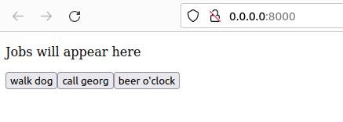
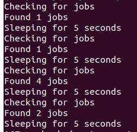

# Selenium-example

Start a web-server from root serving the imaginary website under `./html`:

    python3 -m http.server --directory ./html

If you go to [http://localhost:8000](http://localhost:8000), you should see something like this:

Next start a python process in another terminal scanning for the jobs:

    python3 src/get_jobs.py

The terminal should look something like this:

The process will write the jobs it's retrieved under `jobs/jobs.txt`. An example output:

    JOB-828454 walk dog
    JOB-950760 call georg
    JOB-845944 feed monkey
    JOB-879143 beer o'clock
    JOB-154357 acquire twitter
    JOB-339278 acquire twitter
    JOB-458059 beer o'clock
    JOB-874200 maintain
    JOB-475964 acquire twitter
    JOB-682276 walk dog
    JOB-294050 maintain

